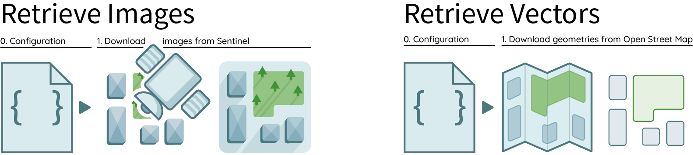

<h1 align="center">geolabel-maker</h1>

<p align="center">
  <a href="" rel="noopener">
  </a>
</p>

<div align="center">

[]()
[](https://pypi.org/project/geolabel-maker/)
[](https://pypi.org/project/geolabel-maker/)
[](/LICENSE)
[]()
[](https://makina-corpus.com/blog/metier/2020/extraction-dobjets-pour-la-cartographie-par-deep-learning-creation-dune-verite-terrain)


</div>

<p align="center"> 
  This tool is provided to help you in your <b>data preparation for geospatial artificial intelligence</b>. Generates your own ground truth from geo-referenced aerial images and vectors in a few lines of code.
</p>

## Table of Contents

-   [About](#about)
-   [Installation](#installation)
-   [Usage](#usage)
-   [Tutorials](#tutorials)
-   [Documentation](#documentation)
-   [For developers](#for-developers)
-   [Contributors](#contributors)
-   [Acknowledgements](#acknowledgements)

## About

With `geolabel-maker`, you will be able to combine satellite or aerial imagery with
vector data to create your own ground-truth dataset. This Python package can
generate your final dataset in various formats for deep-learning models. See [outputs](#outputs) for more details.

It is designed to link up these 4 needed steps :

1. Download and process satellite imagery and vector geometries;
2. Create labels from rasters and geometries;
3. Generate tiles from the satellite images and generated labels;
4. Create an annotation file (`COCO`, `JSON`, `TXT`, `CSV`) for object detection, segmentation or classification.

## Installation


See [requirements.txt](requirements.txt) for the list of the packages used and their version. See these [common issues](#common-issues) if you struggles to install some packages.

Install `geolabel-maker` using `pip` in your terminal:

```
pip install geolabel-maker
```

## Usage



Before to generate your dataset, you will need to provide geo-referenced satellite `images` (i.e. rasters) and `categories` (i.e. vectors). Geolabel Maker provides tools to download imagery from [Sentinel](https://www.sentinel-hub.com/) or [MapBox](https://www.mapbox.com/) and vectors from [Open Street Map](https://www.openstreetmap.org/).
See this [example on how to download data](notebooks/Download%20data%20with%20Geolabel%20Maker.ipynb) for further details.


Once you have geo-referenced rasters and vectors, you are ready to build your own dataset. Geolabel Maker lets you generate labels in different dimensions and resolution. In addition, you can generate tiles in [Slippy Map format](https://wiki.openstreetmap.org/wiki/Slippy_Map) or divide bigger images into a mosaic. See this [example on how to generate a dataset](notebooks/Generate%20a%20dataset%20with%20Geolabel%20Maker.ipynb) for further details.


The final step is to generate you annotations file. This python package lets you create three kinds of annotations: 
- **Classification**, to map images with one category;
- **Object Detection**, to extract object by their bbox in the images (and their corresponding masks);
- **Segmentation**, to extract object by their segmentation in the images (and their corresponding masks).

See this [example on how to generate annotations]() for further details.


### Supported formats

We use packages based on GDAL drivers.

-   for images, see [raster formats](https://gdal.org/drivers/raster/index.html) :
    -   `GeoTIFF`,
    -   `JPEG2000`,
    -   `ASCII Grid`,
    -   etc.
-   for vectors, see [supported drivers](https://github.com/Toblerity/Fiona/blob/master/fiona/drvsupport.py) of the `fiona` package :
    -   `ESRI Shapefile`,
    -   `GeoJSON`,
    -   `GPKG`,
    -   etc.

### Command-line interface

A command-line interface is proposed with 6 available
actions.


**0. `download`: Download rasters or vectors**

```
geolabel_maker download  --config  Path to the configuration file containing your credentials
```

**1. `make_labels`: Create labels from geometries and raster files**

```
geolabel_maker make_labels  --config  (config or root required) Path to the configuration file used to create the dataset
                            --root  (config or root required) Alternatively, the root of the dataset
```

**2. `make_mosaics`: Generate mosaics from the images and labels**

```
geolabel_maker make_mosaics --config  (config or root required) Path to the configuration file used to create the dataset
                            --root  (config or root required) Alternatively, the root of the dataset
                            --zoom  (optional) Zoom interval e.g. 14-20
```

**2. `make_tiles` Generate tiles from the images and labels**

```
geolabel_maker make_tiles --config  (config or root required) Path to the configuration file used to create the dataset
                          --root  (config or root required) Alternatively, the root of the dataset
                          --zoom  (optional) Zoom interval e.g. 14-20
```

**3. `make_annotations`: Create an annotations file**

```
geolabel_maker make_annotations --config  (config or root required) Path to the configuration file used to create the dataset
                                --root  (config or root required) Alternatively, the root of the dataset
                                --dir_images  (optional) Directory containing satellite images
                                --dir_labels  (optional) Directory containing label images
                                --type  (optional) Type of annotation e.g. coco
                                --file  (optional) Output file e.g. coco.json
```

**`make_all`: Run everything**

```
geolabel_maker make_all --config  (config or root required) Path to the configuration file used to create the dataset
                        --root  (config or root required) Alternatively, the root of the dataset
                        --zoom  (optional) Zoom level used e.g. 17
                        --type  (optional) Type of annotation e.g. coco
                        --file  (optional) Output file e.g coco.json
```

### Python API

```python
from geolabel_maker import Dataset
from geolabel_maker.annotations import COCO

# Open the dataset from the root
dataset = Dataset.open("data")
# Create labels from geometries and raster files
dataset.generate_labels()
# Generate mosaics from images and labels
dataset.generate_mosaics(zoom="18", out_dir="mosaics")
# Generate tiles from images and labels
dataset.generate_tiles(zoom="18", out_dir="mosaics")

# Create a COCO annotations
annotation = COCO.build(
    dir_images="mosaics/images",
    dir_labels="mosaics/labels",
    categories=dataset.categories
)
# Save the annotations
annotation.save("coco.json")
```

## Tutorials

* 1 - [Download data with Geolabel Maker](notebooks/Use_geolabel_maker.ipynb) [](https://colab.research.google.com/github/makinacorpus/geolabel-maker/blob/master/notebooks/Download%20data%20with%20Geolabel%20Maker.ipynb)

  This tutorial will guide you on how to download imagery and geometries from different API ([Sentinel Hub](https://www.sentinel-hub.com/), [MapBox](https://www.mapbox.com/) and [Open Street Map](https://www.openstreetmap.org/)).

* 2 - [Generate datasets with Geolabel Maker](notebooks/Use_geolabel_maker.ipynb) [](https://colab.research.google.com/github/makinacorpus/geolabel-maker/blob/master/notebooks/Generate%20datasets%20with%20Geolabel%20%Maker.ipynb)

  This tutorial explains the process to build your own ground truth on a minimal set-up.

* 3 - [Advanced data manipulation with Geolabel Maker](notebooks/Use_geolabel_maker.ipynb) [](https://colab.research.google.com/github/makinacorpus/geolabel-maker/blob/master/notebooks/Generate%20datasets%20with%20Geolabel%20%Maker.ipynb)

  In addition to the previous tutorial, this tutorial covers all methods and interactions that are useful for an in-depth understanding of ``geolabel-maker``.

* 4 - [Check annotations with Geolabel Maker](notebooks/Check_coco_annotations.ipynb) [](https://colab.research.google.com/github/makinacorpus/geolabel-maker/blob/master/notebooks/Check%20annotations%20with%20Geolabel%20Maker.ipynb)

  Finally, this tutorial allows you to explore your final annotations file.


## Documentation

You can read other tutorials (in French) on [Makina Corpus website](https://makina-corpus.com/blog/metier/2020/extraction-dobjets-pour-la-cartographie-par-deep-learning-creation-dune-verite-terrain), or read `geolabel_maker` documentation (in English) on [readthedocs](https://geolabel-maker.readthedocs.io/en/latest/).

## For developers

#### Install from source

```
git clone https://github.com/makinacorpus/geolabel-maker
cd geolabel-maker
pip install -e .
```

#### Pre-commit and linting

-   [Install pre-commit](https://pre-commit.com/#install) and run `pre-commit install`
    to check linting before committing.

-   When you want, you can force a pre-commit on all the files :

```
pre-commit run --all-files
```

#### Build documentation

The documentation is build with `sphinx`. Install it with:

```
pip install sphinx
pip install sphinx_rtd_theme
pip install sphinx_panels
```

Convert the notebooks and add them to the documentation:
```
jupyter nbconvert <notebook_file> --to rst
```

## Common Issues

This section list the known issues with some packages (GDAL, shapely, etc.) and gives some fixes.

<!-- GDAL is not installed ! -->

<details>

<summary><b>GDAL is not installed</b></summary>

> As a particular case, GDAL is not included in `setup.py`.

#### Ubuntu

For `Ubuntu` distributions, the following operations are needed to install this program:

```
sudo apt-get install libgdal-dev
sudo apt-get install python3-gdal
```

The GDAL version can be verified by:

```
gdal-config --version
```

After that, a simple `pip install gdal` (or `conda install gdal`) may be sufficient, however considering our own experience it is not the case on Ubuntu. One has to retrieve a GDAL for Python that corresponds to the GDAL of system:

```
pip install --global-option=build_ext --global-option="-I/usr/include/gdal" GDAL==`gdal-config --version`
python3 -c "import osgeo;print(osgeo.__version__)"
```

#### Windows

For `Windows`, the library can be manually downloaded from the [unofficial library releases](https://www.lfd.uci.edu/~gohlke/pythonlibs/#gdal), which is the most efficient way to install it. You will need to download the version corresponding to your OS platform, then install it:

```
pip install <your_gdal_wheel>
```

#### Other

For other OS, please visit the [GDAL](https://github.com/OSGeo/gdal) installation documentation.

</details>

<!-- END GDAL is not installed ! -->

<!-- Shapely speedups crash for Windows -->

<details>

<summary><b>Shapely speedups crash for Windows</b></summary>

> You may have an error from shapely on windows

If you face any issues from shapely or geometries, try to disable `shapely.speedups`:

```python
from shapely import speedups

speedups.disable()
```

Or set `DISABLE_SPEEDUPS = True` in the `geolabel_maker/__init__.py` file. 

</details>

<!-- END Shapely speedups crash for Windows -->

## Contributors

[](#contributors)

## Acknowledgements

We gratefully acknowledge the contributions of the people who
helped get this project off of the ground, including people who
beta tested the software, gave feedback, improved dependencies of
code in service of this release, or otherwise supported the project.

Particularly thank you [Lucie Camanez](https://github.com/TrueCactus)
to have initiate this project in its internship.

We also acknowledge [Adam Kelly](https://www.immersivelimit.com/)
whose work has helped us in the development of this tool.
