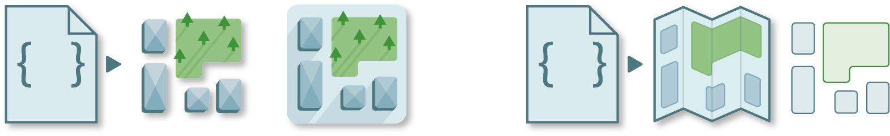

<h1 align="center">geolabel-maker</h1>

<p align="center">
  <a href="" rel="noopener">
  </a>
</p>

<div align="center">

[]()
[](https://pypi.org/project/geolabel-maker/)
[](https://pypi.org/project/geolabel-maker/)
[](/LICENSE)
[]()
[](https://makina-corpus.com/blog/metier/2020/extraction-dobjets-pour-la-cartographie-par-deep-learning-creation-dune-verite-terrain)

</div>

<p align="center"> 
  This tool is provided to help you in your <b>data preparation for geospatial artificial intelligence</b>. Generates your own ground truth from geo-referenced aerial images and vectors in a few lines of code.
</p>


## Table of Contents

-   [About](#about)
-   [Overview](#overview)
    -   [Demo](#demo)
    -   [Summary](#summary)
-   [Workflow](#workflow)
    -   [Download](#download)
    -   [Dataset](#dataset)
    -   [Annotations](#annotations)
-   [Interface](#interface)
    -   [Command-line](#command-line)
    -   [Python](#python)
-   [Install](#install)
-   [Quick Start](#quick-start)
-   [Tutorials](#tutorials)
-   [Documentation](#documentation)
-   [Common Issues](#common-issues)
-   [For developers](#for-developers)
-   [Authors](#authors)
-   [Acknowledgements](#acknowledgements)


## About

With **Geolabel Maker**, you will be able to combine satellite or aerial imagery with vector data to create your own ground-truth dataset. This Python package can generate your final dataset in various formats for deep-learning models.

Build annotations for classification, object detection, semantic and instance segmentation tasks. In addition, you can generate masks, necessary for generative deep learning models.


## Workflow

### Download

If you don't have satellite images or vectors, you can still use Geolabel Maker and generate your ground truth. Geolabel Maker provides tools to download imagery from <a href="https://www.sentinel-hub.com/" target="_blank">Sentinel Hub</a> and <a href="https://www.mapbox.com/" target="_blank">MapBox</a> and vectors from <a href="https://www.openstreetmap.org/" target="_blank">Open Street Map</a>.



<table>
    <thead>
        <th>API</th>
        <th>Data</th>
        <th>Credentials</th>
        <th>Description</th>
    </thead>
    <tbody>
        <tr>
            <td><a href="https://www.sentinel-hub.com/" target="_blank">Sentinel Hub</a></td>
            <td><a href="https://geolabel-maker.readthedocs.io/en/latest/workflow/dataset.html#images">Raster</a></td>
            <td>
                You need a <a href="scihub.copernicus.eu" target="_blank">SciHub account</a>. Then, you must provide your <a href="https://scihub.copernicus.eu/dhus/#/self-registration" target="_blank">username and password</a> to use ESA's platform.
            </td>
            <td>
                Sentinel Hub is a cloud platform provided by the <a href="https://www.esa.int/" target="_blank">European Space Agency (ESA)</a> delivering products from the <a href="https://scihub.copernicus.eu/" target="_blank"> Copernicus</a> program. These products, essentially images from Sentinel 1 and 2 at a resolution between 10m and 60m, are available to download through their APIs.
            </td>
        </tr>
        <tr>
            <td><a href="https://www.mapbox.com/" target="_blank">MapBox</a></td>
            <td><a href="https://geolabel-maker.readthedocs.io/en/latest/workflow/dataset.html#images">Raster</a></td>
            <td>
                You need a <a href="https://account.mapbox.com/" target="_blank">user account</a>. Then, you must provide your <a href="https://docs.mapbox.com/help/getting-started/access-tokens/" target="_blank">access token</a> to use the API.
            </td>
            <td>
                MapBox is a private company operating for Geographic Information System (GIS) worldwide. They provide maps, vectors and other products to the public. Geolabel Maker uses their APIs to download tiles (georeferenced images) at a high resolution.
            </td>
        </tr>
        <tr>
            <td><a href="https://www.openstreetmap.org/" target="_blank">Open Street Map</a></td>
            <td><a href="https://geolabel-maker.readthedocs.io/en/latest/workflow/dataset.html#categories">Category</a></td>
            <td>
                To download vectors on a large scale, Geolabel Maker uses <a href="https://overpass-turbo.eu/" target="_blank">Overpass</a> API that does not require credentials.
            </td>
            <td>
                OpenStreetMap is a collaborative map under an open license. Additionally, it is possible to retrieve information as vectors thanks to their API. Because Geolabel Maker is used to handle large size data, the <a href="https://overpass-turbo.eu/" target="_blank">Overpass</a> API was used.
            </td>
        </tr>
    </tbody>
</table>


### Dataset

A dataset is the main interface for data manipulation and processing. With it, you will be able to generate labels, mosaics and tiles.

Once you have geo-referenced rasters and vectors, you are ready to create your dataset. Geolabel Maker lets you generate masks of the vector data associated to the images (a.k.a. labels) in different dimensions and zoom levels (i.e. resolution). In addition, you can generate tiles in <a href="https://wiki.openstreetmap.org/wiki/Slippy_Map" target="_blank">Slippy Map format</a> or mosaics. 


<table>
    <thead>
        <th colspan=2>Data</th>
        <th>Format</th>
        <th>Description</th>
    </thead>
    <tbody>
        <tr>
            <td rowspan=2><a href="">Raster</a></td>
            <td><a href="https://geolabel-maker.readthedocs.io/en/latest/workflow/dataset.html#images">Image</a></td>
            <td rowspan=2>
                <ul>
                    <li><code>GeoTIFF</code></li>
                    <li><code>JPEG2000</code></li>
                    <li><code>ASCII Grid</code></li>
                    <li><a href="https://gdal.org/drivers/raster/index.html" target="_blank">etc.</a></li>
                </ul>
            </td>
            <td>
                An image refers to a satellite or aerial image. This raster will be used to generate masks.
            </td>
        </tr>
        <tr>
            <td><a href="https://geolabel-maker.readthedocs.io/en/latest/workflow/dataset.html#labels">Label</a></td>
            <td>
                A label raster corresponds to a mask of multiple categories associated to an image. This raster may be used as a ground truth map for your deep learning tasks (e.g. <a href="https://towardsdatascience.com/understanding-semantic-segmentation-with-unet-6be4f42d4b47" target="_blank">U-Net</a> based models or <a href="https://towardsdatascience.com/understanding-generative-adversarial-networks-gans-cd6e4651a29" target="_blank">GANs</a>).
            </td>
        </tr>
        <tr>
            <td colspan=2><a href="https://geolabel-maker.readthedocs.io/en/latest/workflow/dataset.html#categories">Category</a></td>  
            <td>
                <ul>
                    <li><code>GeoJSON</code></li>
                    <li><code>ESRI Shapefile</code></li>
                    <li><code>GPKG</code></li>
                    <li><a href="https://github.com/Toblerity/Fiona/blob/master/fiona/drvsupport.py" target="_blank">etc.</a></li>
                </ul>
            </td>
            <td>
                A category is a set of vector geometries corresponding to a class. For example one could be a set of buildings and another one a set of parkings.
            </td>
        </tr>
        <tr>
            <td colspan=2><a href="https://geolabel-maker.readthedocs.io/en/latest/workflow/dataset.html#mosaics">Mosaics</a></td>
            <td>
                <ul>
                    <li><code>GeoTIFF</code></li>
                </ul>
            </td>
            <td>
                A mosaic is a set of multiple sub images. Assembled, these images make up the original images / labels. If generated, the mosaics are in <code>GeoTIFF</code> format to keep geographic information and metadata. You can generate your sub images at different <a href="https://wiki.openstreetmap.org/wiki/Zoom_levels" target="_blank">zoom levels</a>. In addition it is possible to parameterize the output’s images dimensions.
            </td>
        </tr>
        <tr>
            <td colspan=2><a href="https://geolabel-maker.readthedocs.io/en/latest/workflow/dataset.html#tiles">Tiles</a></td>
            <td>
                <ul>
                    <li><code>PNG</code></li>
                </ul>
            </td>
            <td>
                Tiles refers to sub images / labels in the <a href="https://wiki.openstreetmap.org/wiki/Slippy_Map" target="_blank">Slippy Map</a> format. Slippy maps are essentially used as a web interface. Because each tile is projected in the web mercator coordinate reference system, the creation of tiles is slow.
            </td>
        </tr>
    </tbody>
</table>


### Annotations

The final step is to generate your annotations file. This step may be optional if your model only requires rasters as ground truth, like generative adversarial networks. However, some models require annotations in other formats like <a href="https://towardsdatascience.com/computer-vision-instance-segmentation-with-mask-r-cnn-7983502fcad1" target="_blank">Mask R-CNN</a> for instance segmentation, <a href="https://towardsdatascience.com/yolo-you-only-look-once-real-time-object-detection-explained-492dc9230006" target="_blank">YOLO</a> for object detection or <a href="https://towardsdatascience.com/an-overview-of-resnet-and-its-variants-5281e2f56035" target="_blank">ResNet</a> for classification tasks.

You can either generate the annotations using the previous labels or directly from the vector geometries.


<table>
    <thead>
        <th>Annotations</th>
        <th>Format</th>
        <th>Description</th>
    </thead>
    <tbody>
        <tr>
            <td><a href="https://geolabel-maker.readthedocs.io/en/latest/workflow/annotations.html#classification">Classification</a></td>
            <td>
                <ul>
                    <li><code>JSON</code></li>
                    <li><code>TXT</code></li>
                    <li><code>CSV</code></li>
                    <li><a href="">etc.</a></li>
                </ul>
            </td>
            <td>
                These annotations are used to know if a category is visible from an image.
            </td>
        </tr>
        <tr>
            <td><a href="https://geolabel-maker.readthedocs.io/en/latest/workflow/annotations.html#object-detection">Object Detection</a></td>
            <td>
                <ul>
                    <li><code>JSON</code></li>
                </ul>
            </td>
            <td>
                These annotations are used to know the bounding box / localization of objects in images.
            </td>
        </tr>
        <tr>
            <td><a href="https://geolabel-maker.readthedocs.io/en/latest/workflow/annotations.html#segmentation">Segmentation</a></td>
            <td>
                <ul>
                    <li><code>JSON</code></li>
                </ul>
            </td>
            <td>
                These annotations are used to know the exact geometry of objects in images. It follows the format
                <a href="http://cocodataset.org/" target="_blank">Common Object in COntext (COCO)</a>
                used by Microsoft.
            </td>
        </tr>
    </tbody>
</table>


## Interface

### Command-line

A command-line interface is proposed with the main actions. These commands work in a terminal containing a python environment.

<table>
    <thead>
        <tr>
            <th>Command</th>
            <th>Sub Command</th>
            <th>Description</th>
        </tr>
    </thead>
    <tbody>
        <tr>
            <td><code><a href="https://geolabel-maker.readthedocs.io/en/latest/interface/command-line.html">geolabel_maker</a></code></td>
            <td><code><a href="https://geolabel-maker.readthedocs.io/en/latest/interface/command-line.html#download">download</a></code></td>
            <td>
                Downloads rasters or vectors from <a href="#download">SentinelHub</a>, <a href="#download">MapBox</a> or <a href="#download"> OpenStreetMap</a>.
            </td>
        </tr>
        <tr>
            <td><code><a href="https://geolabel-maker.readthedocs.io/en/latest/interface/command-line.html">geolabel_maker</a></code></td>
            <td><code><a href="https://geolabel-maker.readthedocs.io/en/latest/interface/command-line.html#labels">labels</a></code></td>
            <td>
                Creates <a href="#dataset">labels</a> / masks from satellite or aerial images and vector geometries.
            </td>
        </tr>
        <tr>
            <td><code><a href="https://geolabel-maker.readthedocs.io/en/latest/interface/command-line.html">geolabel_maker</a></code></td>
            <td><code><a href="https://geolabel-maker.readthedocs.io/en/latest/interface/command-line.html">mosaics</a></code></td>
            <td>
                Generates <a href="#dataset">mosaics</a> at custom sizes from the satellite images and labels.
            </td>
        </tr>
        <tr>
            <td><code><a href="https://geolabel-maker.readthedocs.io/en/latest/interface/command-line.html">geolabel_maker</a></code></td>
            <td><code><a href="https://geolabel-maker.readthedocs.io/en/latest/interface/command-line.html#tiles">tiles</a></code></td>
            <td>
                Generates <a href="#dataset">tiles</a> of size 256x256 from the satellite images and labels.
            </td>
        </tr>
        <tr>
            <td><code><a href="https://geolabel-maker.readthedocs.io/en/latest/interface/command-line.html">geolabel_maker</a></code></td>
            <td><code><a href="https://geolabel-maker.readthedocs.io/en/latest/interface/command-line.html#annotations">annotations</a></code></td>
            <td>
                Creates an <a href="#dataset">annotations</a> file for the task of your choice.
            </td>
        </tr>
    </tbody>
</table>

To have a better insight of the arguments required, you can use the ``help`` argument:

```
geolabel_maker --help
geolabel_maker <sub-command> --help
```

### Python

It is also possible to use the python interface to have more control over the workflow.

<table>
    <thead>
        <th>Class</th>
        <th>Description</th>
    </thead>
    <tbody>
        <tr>
            <td><code><a href="https://geolabel-maker.readthedocs.io/en/latest/interface/python.html" target="_blank">Raster</a></code></td>
            <td>
                Defines geo-referenced images. It relies on <a href="https://gdal.org/" target="_blank">GDAL</a> and <a href="">rasterio</a>.
            </td>
        </tr>
        <tr>
            <td><code><a href="https://geolabel-maker.readthedocs.io/en/latest/interface/python.html" target="_blank">Category</a></code></td>
            <td>
                Defines geographic vector data. It relies on <a href="https://geopandas.org/" target="_blank">geopandas</a> and <a href="https://pyproj4.github.io/pyproj/stable/">pyproj</a>.
            </td>
        </tr>
        <tr>
            <td><code><a href="https://geolabel-maker.readthedocs.io/en/latest/interface/python.html" target="_blank">RasterCollection</a></code></td>
            <td>
                Is used to store and process multiple <code>Raster</code>.
            </td>
        </tr>
        <tr>
            <td><code><a href="https://geolabel-maker.readthedocs.io/en/latest/interface/python.html" target="_blank">CategoryCollection</a></code></td>
            <td>
                Is used to store and process multiple <code>Category</code>.
            </td>
        </tr>
        <tr>
            <td><code><a href="https://geolabel-maker.readthedocs.io/en/latest/interface/python.html" target="_blank">Dataset</a></code></td>
            <td>
                Main interface of Geolabel Maker. A dataset contains a collection of images, categories. This interface is used to generate labels, mosaics or tiles.
            </td>
        </tr>
        <tr>
            <td><code><a href="https://geolabel-maker.readthedocs.io/en/latest/interface/python.html" target="_blank">Classification</a></code></td>
            <td>
                Defines and generates annotations for classification tasks.
            </td>
        </tr>
        <tr>
            <td><code><a href="https://geolabel-maker.readthedocs.io/en/latest/interface/python.html" target="_blank">ObjectDetection</a></code></td>
            <td>
                Defines and generates annotations for object detection tasks.
            </td>
        </tr>
        <tr>
            <td><code><a href="https://geolabel-maker.readthedocs.io/en/latest/interface/python.html" target="_blank">Segmentation</a></code></td>
            <td>
                Defines and generatesSegmentation annotations, in <a href="https://cocodataset.org">COCO</a> format, for instance segmentation tasks.
            </td>
        </tr>
    </tbody>
</table>


## Install


See [requirements.txt](requirements.txt) for the list of the packages used and their version. See these [common issues](#common-issues) if you struggle to install some packages.

Install `geolabel-maker` using `pip` in your terminal:

```
pip install geolabel-maker
```


## Quick Start

The following example will illustrate how to generate and process labels and annotations from scratch.

### Data

First, download images and categories from <a href="https://download.data.grandlyon.com" target="_blank">Grand Lyon website</a>:

- **images**: download the following rasters in ``data/images`` directory.
    -   [1843_5173_08_CC46.tif](https://download.data.grandlyon.com/files/grandlyon/imagerie/ortho2018/ortho/GeoTiff_YcBcR/1km_8cm_CC46/1843_5173_08_CC46.tif)
    -   [1844_5173_08_CC46.tif](https://download.data.grandlyon.com/files/grandlyon/imagerie/ortho2018/ortho/GeoTiff_YcBcR/1km_8cm_CC46/1844_5173_08_CC46.tif)

- **categories**: download the following geometries in the ``data/categories`` directory.
    - [buildings.json](https://download.data.grandlyon.com/wfs/grandlyon?SERVICE=WFS&VERSION=2.0.0&request=GetFeature&typename=cad_cadastre.cadbatiment&outputFormat=application/json;%20subtype=geojson&SRSNAME=EPSG:4171)
    - [vegetation.json](https://download.data.grandlyon.com/wfs/grandlyon?SERVICE=WFS&VERSION=2.0.0&request=GetFeature&typename=com_donnees_communales.comparcjardin_1_0_0&outputFormat=application/json;%20subtype=geojson&SRSNAME=EPSG:4171)
    - [bridges.json](https://download.data.grandlyon.com/wfs/grandlyon?SERVICE=WFS&VERSION=2.0.0&request=GetFeature&typename=fpc_fond_plan_communaut.fpcpont&outputFormat=application/json;%20subtype=geojson&SRSNAME=EPSG:4171)


### Configuration

Then, create the following configuration in ``data/dataset.json``:

```json
{
    "dir_images": "images",
    "dir_categories": "categories",
    "categories": [
        {
            "filename": "bridges.json",
            "name": "bridges",
            "color": "skyblue"
        },
        {
            "filename": "buildings.json",
            "name": "buildings",
            "color": "white"
        },
        {
            "filename": "vegetation.json",
            "name": "vegetation",
            "color": "green"
        }
    ]
}
```

Your tree structure should be:

```
data
├── categories
│   ├── bridges.json
│   ├── buildings.json
│   └── vegetation.json
├── images
│   ├── 1843_5173_08_CC46.tif
│   └── 1844_5173_08_CC46.tif   
└── dataset.json
```


### Command-line

```
geolabel_maker labels --config data/dataset.json

geolabel_maker mosaics --config data/dataset.json --zoom 19

geolabel_maker annotations --config data/dataset.json --ann_type coco
```


### Python

```python
from geolabel_maker import Dataset
from geolabel_maker.annotations import COCO

# Open the dataset from your configuration
dataset = Dataset.open("data/dataset.json")

# Create labels from geometries and raster files
dataset.generate_labels()
# Generate mosaics from images and labels
dataset.generate_mosaics(zoom=19, width=500, height=500)

# Create a COCO annotations
annotation = COCO.build(
    dir_images="data/mosaics/images/19",
    dir_labels="data/mosaics/labels/19",
    colors={"bridges": "skyblue", "buildings": "white", "vegetation": "green"}
)
# Save the annotations
annotation.save("coco.json")
```


## Tutorials

-   1 - [Download data with Geolabel Maker](notebooks/Download%20data%20with%20Geolabel%20Maker.ipynb) &nbsp; [](https://colab.research.google.com/github/makinacorpus/geolabel-maker/blob/master/notebooks/Download%20data%20with%20Geolabel%20Maker.ipynb)

    This tutorial will guide you on how to download imagery and geometries from different API ([Sentinel Hub](https://www.sentinel-hub.com/), [MapBox](https://www.mapbox.com/) and [Open Street Map](https://www.openstreetmap.org/)).

-   2 - [Generate annotations with Geolabel Maker](notebooks/Generate%20annotations%20with%20Geolabel%20Maker.ipynb) &nbsp; [](https://colab.research.google.com/github/makinacorpus/geolabel-maker/blob/master/notebooks/Generate%20annotations%20with%20Geolabel%20Maker.ipynb)

    This tutorial explains the process to build your own ground truth on a minimal set-up.

-   3 - [Advanced data manipulation with Geolabel Maker](notebooks/Advanced%20data%20manipulation%20with%20Geolabel%20Maker.ipynb) &nbsp; [](https://colab.research.google.com/github/makinacorpus/geolabel-maker/blob/master/notebooks/Advanced%20data%20manipulation%20with%20Geolabel%20Maker.ipynb)

    In addition to the previous tutorial, this tutorial covers all methods and interactions that are useful for an in-depth understanding of Geolabel Maker.

-   4 - [Check COCO annotations with pycocotools](notebooks/Check%20COCO%20annotations%20with%20pycocotools.ipynb) &nbsp; [](https://colab.research.google.com/github/makinacorpus/geolabel-maker/blob/master/notebooks/Check%20COCO%20annotations%20with%20pycocotools.ipynb)

    Finally, this tutorial allows you to explore your final annotations file.

## Documentation

You can read other tutorials (in French) on <a href="https://makina-corpus.com/blog/metier/2020/extraction-dobjets-pour-la-cartographie-par-deep-learning-creation-dune-verite-terrain" target="_blank">Makina Corpus website</a>, or read `geolabel_maker` documentation (in English) on <a href="https://geolabel-maker.readthedocs.io/en/latest/" target="_blank">readthedocs</a>.

## For developers

#### Install from source

```
git clone -b projinfo-dev https://github.com/makinacorpus/geolabel-maker
cd geolabel-maker
pip install -e .
```

#### Pre-commit and linting

-   <a href="https://pre-commit.com/#install" target="_blank">Install pre-commit</a> and run `pre-commit install`
    to check linting before committing.

-   When you want, you can force a pre-commit on all the files :

```
pre-commit run --all-files
```

#### Build documentation

The documentation is build with `sphinx`. Install it (and its extensions) with:

```
pip install sphinx
pip install sphinx_rtd_theme
pip install sphinx_panels
```

Then, build the documentation in the `docs/` directory:
```
make clean
make html
```

## Common Issues

This section list the known issues with some packages (GDAL, shapely, etc.) and gives some fixes.

<!-- GDAL is not installed ! -->

<details>

<summary><b>GDAL is not installed</b></summary>

> As a particular case, GDAL is not included in `setup.py`.

#### Ubuntu

For `Ubuntu` distributions, the following operations are needed to install this program:

```
sudo apt-get install libgdal-dev
sudo apt-get install python3-gdal
```

The GDAL version can be verified by:

```
gdal-config --version
```

After that, a simple `pip install gdal` (or `conda install gdal`) may be sufficient, however considering our own experience it is not the case on Ubuntu. One has to retrieve a GDAL for Python that corresponds to the GDAL of system:

```
pip install --global-option=build_ext --global-option="-I/usr/include/gdal" GDAL==`gdal-config --version`
python3 -c "import osgeo;print(osgeo.__version__)"
```

#### Windows

For `Windows`, the library can be manually downloaded from the <a href="https://www.lfd.uci.edu/~gohlke/pythonlibs/#gdal" target="_blank">unofficial library releases</a>, which is the most efficient way to install it. You will need to download the version corresponding to your OS platform, then install it:

```
pip install <your_gdal_wheel>
```

#### Other

For other OS, please visit the <a href="https://github.com/OSGeo/gdal" target="_blank">GDAL</a> installation documentation.

</details>

<!-- END GDAL is not installed ! -->

<!-- Shapely speedups crash for Windows -->

<details>

<summary><b>Shapely speedups crash for Windows</b></summary>

> You may have an error from shapely on windows

If you face any issues from shapely or geometries, try to disable `shapely.speedups`:

```python
from shapely import speedups

speedups.disable()
```

Or set `DISABLE_SPEEDUPS = True` in the `geolabel_maker/__init__.py` file.

</details>

<!-- END Shapely speedups crash for Windows -->

## Authors

- [Daphné Lercier (@dlercier)](https://github.com/dlercier): supervised the project

- [Arthur Dujardin (@arthurdjn)](https://github.com/arthurdjn): fixed issues, optimized, and pushed the project further

- [Lucie Camanez (@truecatus)](https://github.com/truecactus): started the project


## Acknowledgements

We gratefully acknowledge the contributions of the people who
helped get this project off of the ground, including people who
beta tested the software, gave feedback, improved dependencies of
code in service of this release, or otherwise supported the project.

Particularly thank you <a href="https://github.com/TrueCactus" target="_blank">Lucie Camanez</a>
to have initiate this project in its internship.

We also acknowledge <a href="https://www.immersivelimit.com/" target="_blank">Adam Kelly</a>
whose work has helped us in the development of this tool.
