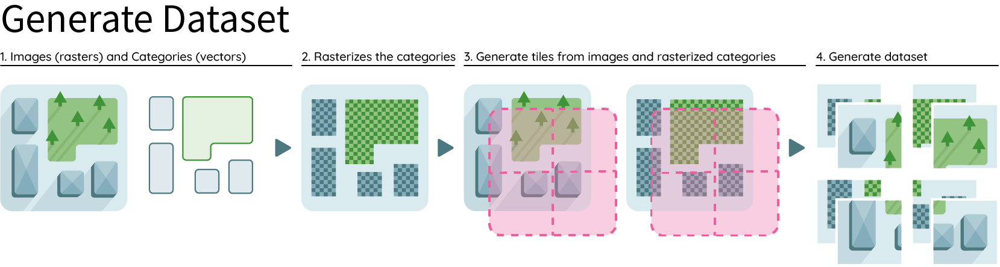

=====
About
=====

.. image:: ../medias/geolabel_maker.gif

With ``geolabel-maker``\ , you will be able to combine satellite or aerial imagery with
vector spatial data to create your own ground-truth dataset. This Python package can
generate your final dataset in various formats for deep-learning models. See `outputs <#outputs>`_ for more details.

It is designed to link up these 4 needed steps :

#. Download satellite images and vector geometries;
#. Create labels from geometries and raster files;
#. Generate tiles from the satellite images and labels;
#. Create an annotation file (\ ``JSON``\ , ``TXT``\ , ``CSV``\ ) for object detection, segmentation or classification.

.. image:: ../medias/data.png
   :target: ../medias/data.png
   :alt: data

Before to generate your dataset, you will need to provide geo-referenced satellite ``images`` (i.e. rasters) 
and ``categories`` (i.e. vectors). 
See this `example on how to download data <../examples/data.html>`_ for further details.

Once you have geo-referenced rasters and vectors, you are ready to build your own dataset. 
List the different categories (e.g. buildings, vegetation) in ``categories.json`` that will be used as masks. 
You will need to create tiles for the images and labels (i.e. rasterized vectors) to be able to generate your annotations file. 
See this `example on how to generate a dataset <../examples/dataset.html>`_ for further details.

.. image:: ../medias/annotations.png
   :target: ../medias/annotations.png
   :alt: annotations

The final step is to generate you annotations file. 
This python package lets you create three kinds of annotations: 

See this `example on how to generate annotations <../examples/annotations.html>`_ for further details.