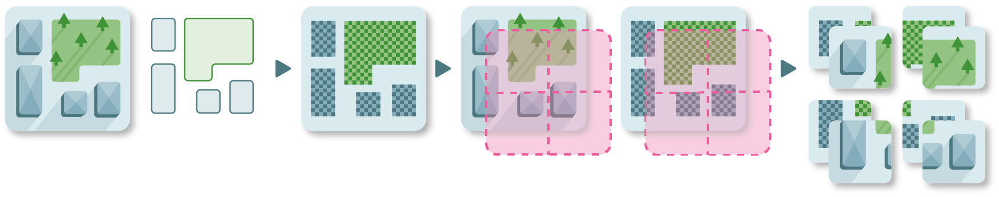

=======
Dataset
=======

A dataset is the main interface for data manipulation and processing.
With it, you will be able to generate labels, mosaics and tiles.

Once you have geo-referenced rasters and vectors, you are ready to create your dataset. 
Geolabel Maker lets you generate raster masks of the vector geometries associated to the images (a.k.a. labels) 
in different dimensions and zoom level (i.e. resolution). 
In addition, you can generate tiles in `Slippy Map format <https://wiki.openstreetmap.org/wiki/Slippy_Map>`__ or mosaics. 

Images
======

An image refers to a satellite or aerial image. 
This raster will be used to generate masks.

.. note::
    The supported drivers are the one from 
    `gdal <https://gdal.org/drivers/raster/index.html>`__ package.

Categories
==========

A category is a set of vector geometries corresponding to a class. 
It must have a name designing the type of the category and optionally a color 
(if no colors are found, random one will be generated).
This color will be used during the labels generation.
For example one could be a set of buildings and another one a set of parkings.

.. note::
    The supported drivers are the one from 
    `fiona <https://github.com/Toblerity/Fiona/blob/master/fiona/drvsupport.py>`__ package.

Labels
======

A label raster corresponds to a mask of multiple categories associated to an image. 
This raster may be used as a ground truth map for your deep learning tasks 
(e.g. `U-Net <https://towardsdatascience.com/understanding-semantic-segmentation-with-unet-6be4f42d4b47>`__ 
based models or `GANs <https://towardsdatascience.com/understanding-generative-adversarial-networks-gans-cd6e4651a29>`__).

.. seealso::
    The supported drivers are the same as the ones for the `images <#images>`__.

Mosaics
=======

A mosaic is a set of multiple sub images. 
Assembled, these images make up the original images / labels.
If generated, the mosaics are in ``GeoTIFF``\ format to keep geographic information and metadata.
You can generate your sub images at different `zoom levels <https://wiki.openstreetmap.org/wiki/Zoom_levels>`__.
In addition it is possible to parameterize the output's images dimensions.

.. note::
   This method is well suited for deep learning tasks.
   You can generate a large quantity of masks in no time.

Tiles
=====

Tiles refers to sub images / labels in the `Slippy Map format <https://wiki.openstreetmap.org/wiki/Slippy_Map>`__.
Slippy maps are essentially used as a web interface.
Because each tile is projected in the web mercator coordinate reference system,
the creation of tiles is slow.

.. warning::
   The generation of tiles can take hours (or days).
   Unlike `mosaics <#mosaics>`__, it is not possible to parameterize the tiles dimensions.

.. note::
   Usually deep learning models don't require inputs and labels in such formats,
   so you may stick with the `mosaics <#mosaics>`__.

Configuration
=============

To make the interface smoother, 
you can store your data in a configuration file.
In this file, you can store the paths to your images, categories and labels.
You can also tune your preferences through this file.

+---------------------------------------+-----------------+-------------------------------------------------------------------------------------+
| **Key**                               | **Type**        | **Description**                                                                     |
+---------------------------------------+-----------------+-------------------------------------------------------------------------------------+
| :attr:`dir_images`                    | str             | Path to the directory containing the images.                                        |
+---------------------------------------+-----------------+-------------------------------------------------------------------------------------+
| :attr:`dir_categories`                | str             | Path to the directory containing the categories.                                    |
+---------------------------------------+-----------------+-------------------------------------------------------------------------------------+
| :attr:`dir_labels`                    | str             | Path to the directory containing the labels.                                        |
+--------------------+------------------+-----------------+-------------------------------------------------------------------------------------+
| :attr:`images`     | :attr:`id`       | int             | Id of an image.                                                                     |
|                    +------------------+-----------------+-------------------------------------------------------------------------------------+
|                    | :attr:`filename` | str             | Path or name of the image file.                                                     |
|                    |                  |                 | If :attr:`dir_images` is provided, the path must be relative to this directory.     |
+--------------------+------------------+-----------------+-------------------------------------------------------------------------------------+
| :attr:`categories` | :attr:`id`       | int             | Id of a category.                                                                   |
|                    +------------------+-----------------+-------------------------------------------------------------------------------------+
|                    | :attr:`filename` | str             | Path or name of the category file.                                                  |
|                    |                  |                 | If :attr:`dir_categories` is provided, the path must be relative to this directory. |
|                    +------------------+-----------------+-------------------------------------------------------------------------------------+
|                    | :attr:`name`     | str             | Name of the category.                                                               |
|                    +------------------+-----------------+-------------------------------------------------------------------------------------+
|                    | :attr:`color`    | str, RGB values | Color of the category.                                                              |
+--------------------+------------------+-----------------+-------------------------------------------------------------------------------------+
| :attr:`labels`     | :attr:`id`       | int             | Id of a label.                                                                      |
|                    +------------------+-----------------+-------------------------------------------------------------------------------------+
|                    | :attr:`filename` | str             | Path or name of the label file.                                                     |
|                    |                  |                 | If :attr:`dir_labels` is provided, the path must be relative to this directory.     |
+--------------------+------------------+-----------------+-------------------------------------------------------------------------------------+

**Example 1**

.. code-block::
   	
   {
      "dir_images": "images",
      "dir_categories": "categories"
   }

**Example 2**

.. code-block::
      
   {
      "dir_images": "images",
      "dir_categories": "categories"
      "dir_labels": "labels"
   }

**Example 3**

.. code-block::

   {
      "images": [
         {
            "id": 0,
            "filename": "some/directory/1842_5174_08_CC46.tif"
         },
         {
            "id": 1,
            "filename": "other/directory/1842_5175_08_CC46.tif"
         }
      ],
      "categories": [
         {
            "id": 0,
            "name": "vegetation",
            "color": "green",
            "filename": "some/other/directory/vegetation.json"
         },
         {
            "id": 1,
            "name": "buildings",
            "color": [
                  17,
                  227,
                  242
            ],
            "filename": "another/directory/buildings.json"
         }
      ]
   }

**Example 4**

.. code-block::

   {
      "dir_images": "images",
      "dir_categories": "categories",
      "categories": [
         {
            "id": 0,
            "name": "vegetation",
            "color": "green",
            "filename": "vegetation.json"
         },
         {
            "id": 1,
            "name": "buildings",
            "color": "white",
            "filename": "buildings.json"
         }
      ]
   }