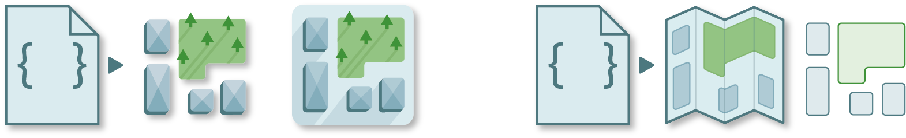

========
Download
========

Once you have geo-referenced rasters and vectors, you are ready to create your dataset. 
Geolabel Maker lets you generate raster masks of the vector geometries associated to the images (a.k.a. labels) in different dimensions and zoom level (i.e. resolution). 
In addition, you can generate tiles in `Slippy Map format <https://wiki.openstreetmap.org/wiki/Slippy_Map>`__ or mosaics.

Sentinel Hub
============

Sentinel Hub is a cloud platform provided by the `European Space Agency (ESA) <https://www.esa.int/>`__
delivering products from the `Copernicus <https://scihub.copernicus.eu/>`__ program.
These products, essentially images from Sentinel 1 and 2 at a resolution between 10m and 60m, 
are available to download through their APIs.

.. note::
    You need a `SciHub <https://scihub.copernicus.eu/dhus/#/self-registration>`__ account. 
    Then, you must provide your username and password to use `ESA <https://www.esa.int/>`__'s platform.

Map Box
=======

Map Box is a private company operating for Geographic Information System (GIS) worldwide.
They provide maps, vectors and other products to the public.
Geolabel Maker uses their APIs to download tiles (georeferenced images) at a high resolution.

.. note::
    You need an `user account <https://account.mapbox.com/>`__. 
    Then, you must provide your `access token <https://docs.mapbox.com/help/getting-started/access-tokens/>`__ to use the API.

Open Street Map
===============

`Open Street Map <https://www.openstreetmap.org/>`__ is a collaborative map under an open license.
Additionally, it is possible to retrieve information as vectors thanks to their API.
Because Geolabel Maker is used to handle large size data,
the `Overpass <https://overpass-turbo.eu/>`__ API was used.

.. note::
    Open Street Map is free to use, thus you don't need an account.

Configuration
=============

To make the interface smoother, 
you can store your credentials in a configuration file. 
This will be handy for further usage.

+-------------------------------------------------------------+----------+---------------------------------------------------------------------+
| **Key**                                                     | **Type** | **Description**                                                     |
+-------------------------------------------------------------+----------+---------------------------------------------------------------------+
| :attr:`dir_images`                                          | str      | Path to the directory where the images will be downloaded.          |
+-------------------------------------------------------------+----------+---------------------------------------------------------------------+
| :attr:`dir_categories`                                      | str      | Path to the directory where the categories will be downloaded.      |
+-------------------------------------------------------------+----------+---------------------------------------------------------------------+
| :attr:`bbox`                                                | list     | Bounding box, in geographic coordinates (lat, lon).                 |
+---------------------+---------------------------------------+----------+---------------------------------------------------------------------+
| :attr:`sentinelhub` | :attr:`username`                      | str      | Username associated to the SciHub account.                          |
|                     +---------------------------------------+----------+---------------------------------------------------------------------+
|                     | :attr:`password`                      | str      | Password associated to the SciHub account.                          |
|                     +---------------------------------------+----------+---------------------------------------------------------------------+
|                     | *other arguments*                     | any      | Other arguments from `SentinelHubAPI <../interface/python.html>`__. |
+---------------------+---------------------------------------+----------+---------------------------------------------------------------------+
| :attr:`mapbox`      | :attr:`access_token`                  | str      | Access token associated to the MapBox account.                      |
+---------------------+---------------------------------------+----------+---------------------------------------------------------------------+
|                     | *other arguments*                     | any      | Other arguments from `MapBoxAPI <../interface/python.html>`__.      |
+---------------------+-------------------+-------------------+----------+---------------------------------------------------------------------+
| :attr:`overpass`    | :attr:`selectors` | :attr:`selector`  | str      | Open Street Map selector used to retrieve geometries.               |
|                     |                   +-------------------+----------+---------------------------------------------------------------------+
|                     |                   | :attr:`name`      | str      | Name of the output category.                                        |
|                     |                   +-------------------+----------+---------------------------------------------------------------------+
|                     |                   | *other arguments* | str      | Other arguments from `OverpassAPI <../interface/python.html>`__.    |
+---------------------+-------------------+-------------------+----------+---------------------------------------------------------------------+

**Example**

.. code-block::

    {
        "dir_images": "images",
        "dir_categories": "categories",
        "bbox": [2.34, 48.84, 2.36, 48.86],
        "crs": "EPSG:3946",
        "sentinelhub": {
            "username": "...",
            "password": "...",
            "date": ["20200920", "20201020"],
            "platformname": "Sentinel-2",
            "processinglevel": "Level-2A",
            "cloudcoverpercentage": [0, 10],
            "bandname": "TCI",
            "resolution": 10
        },
        "mapbox": {
            "access_token": "...",
            "zoom"=17, 
            "high_res": true,      
            "width": 10240,       
            "height": 10240,   
        },
        "overpass": {
            "categories": [
                {
                    "selector": "building",
                    "name": "buildings"
                },
                {
                    "selector": "natural=wood",
                    "name": "woods"
                }
            ]
        }
    } 